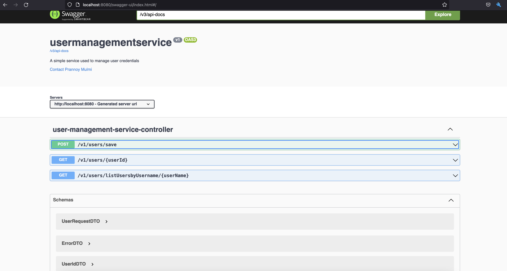
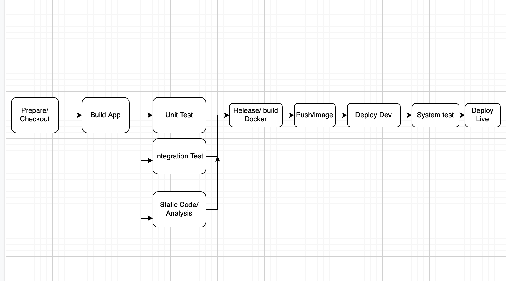

# user-data-service
This is a simple CRUD application written in Spring boot framework. This Application allows one to save a 
users data and query them using their.

## Tests
This project compromises of unit tests and integration tests. They are separated in different modules test and
integration test. The modules are separated in such a manner so that the stages can be separately run in a 
CI/CD Pipeline.

## Swagger
The Server is running in the default port 8080
When the application is started the post request can be sent using the swagger ui present in the application itself.
[Swagger UI local link](http://localhost:8080/swagger-ui.html). It is important that the application to be started before to use
swagger. A Screenshot of the Swagger UI can be seen below.

also possible to list the users and search for user names.

## CI/CD Design
A CI/CD is also very crucial toward the development and release of the software. The CI/CD should allow to test and deploy
the application in the shortest amount of time. Below in a design of how a CI/CI pipeline could be realized.

The design principle is very simple and straight forward. The pipeline will be highly automated as possible,
what this means is the pipeline will checkout, build test and deploy the application in the same pipeline as
seen in the picture. 

## Cloud Architecture 
For the simple concept I will use AWS cloud and its services required to make the app running in the cloud
* AWS Fargate to deploy the service in a scalable manner without much operational overhead.
* AWS Application Loadbalancer to distribute the traffic to all the healthy task, so the load wont be unequal.
* AWS ECR to store our built images which will be deployed in fargate.
* Use AWS Aurora Postgres or Mysql database for the app
* Route53 to manage a proper domain to use the service instead of its default domain.
* Cloudwatch or datadog to store and monitor the application metrics
* SNS to send alarms or message in case of any unwanted events occurring

All of the infrastructure will be rolled out using an IaC(i.e. terraform, cdk etc). In this way the service and
all its dependent services can be deployed using a CI/CD pipeline. 

The same can also be realized using AWS Lambdas and could also be advantageous as we can save on running costs
as Lambda does not have to run continuously like fargate servers but in the downside running Java (JVM) in the
lightweight lambda seems to be the bottleneck where I think it is better to use a Fargate service.

##Architecture Decision Records

Some decisions that I took while implemented this service are documented using ADR. [Link to ADR](./doc/adr)

-------------------------
